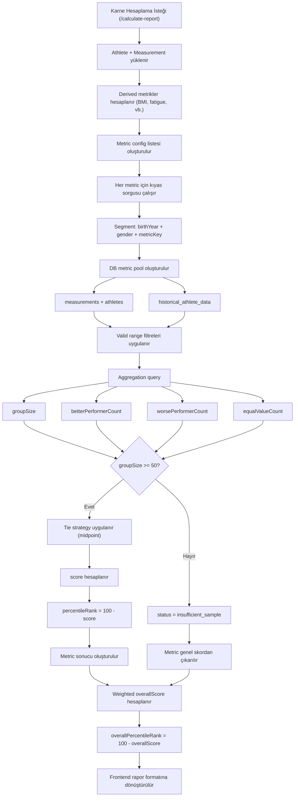
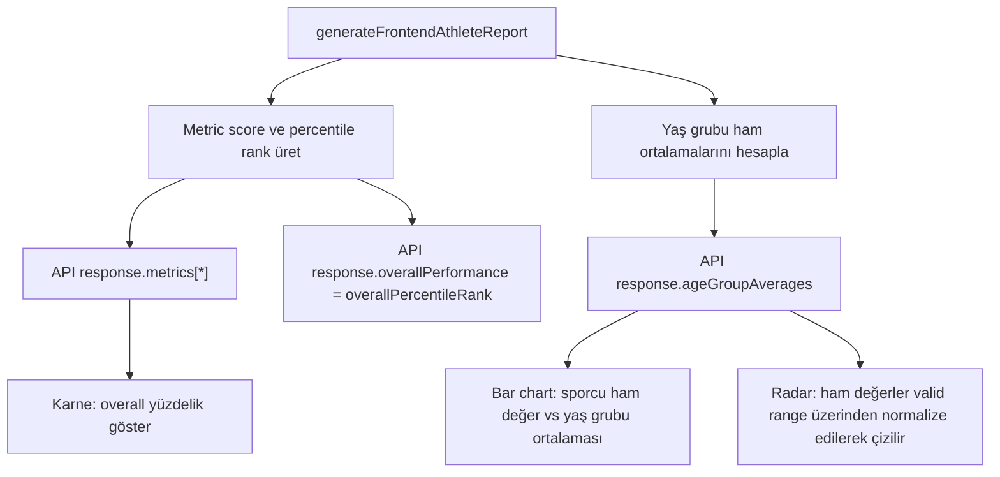
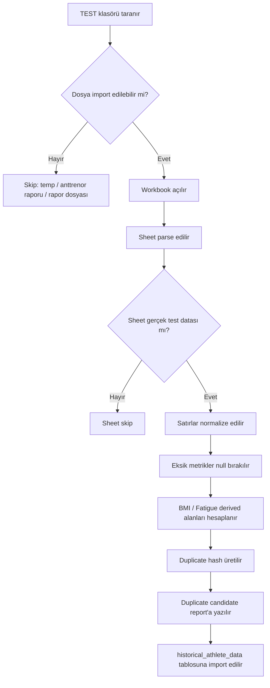

# Age Group Ranking Algorithm

Bu doküman karne hesaplamasında kullanılan yaş grubu kıyas algoritmasının teknik akışını özetler.

## Kural Özeti

- Segment sadece `birthYear + gender + metricKey`
- Minimum örneklem: `50`
- `lower_is_better` ve `higher_is_better` metric config üzerinden yönetilir
- `null` veya geçersiz metrik genel skora girmez
- `insufficient_sample` olan metrik genel skora girmez
- `score = grubun yüzde kaçından daha iyi olduğu`
- `percentileRank = 100 - score`
- `overallScore = geçerli metrik skorlarının weighted average değeri`
- `overallPercentileRank = 100 - overallScore`
- Karne üzerinde gösterilen ana sayı `overallPercentileRank` değeridir

## Akış Diyagramı

## Metrik Bazlı Mantık

### lower_is_better

Örnek: `sprint_30m`, `agility`

- daha iyi performans: daha düşük değer
- better performers: `metric_value < athleteValue`
- worse performers: `metric_value > athleteValue`

### higher_is_better

Örnek: `vertical_jump`, `flexibility`, `pass_count`, `ffmi`

- daha iyi performans: daha yüksek değer
- better performers: `metric_value > athleteValue`
- worse performers: `metric_value < athleteValue`

## Tie Handling

Varsayılan strateji: `midpoint`

Formül:

- `tieAdjustedBetterThanCount = worsePerformerCount + (equalValueCount / 2)`
- `score = (tieAdjustedBetterThanCount / groupSize) * 100`

Bu yaklaşım aynı değere sahip sporcuların deterministic ve dengeli puanlanmasını sağlar.

## Karne Görselleştirme Akışı

## Chart Notu

- Bar chart tarafında her metrik için yeşil bar sporcunun ham değeri, gri bar aynı `birthYear + gender` grubunun ham ortalamasıdır.
- Radar chart tarafında da kaynak veri yine ham değerdir; sadece ortak eksende çizilebilmesi için metric config içindeki valid range kullanılarak normalize edilir.
- Bu yüzden radar üzerinde görülen değer bir “ortalama skor 50” mantığı değildir; yaş grubu ortalamasının ham metrikten türetilmiş normalize görsel karşılığıdır.

## Import Akışı

